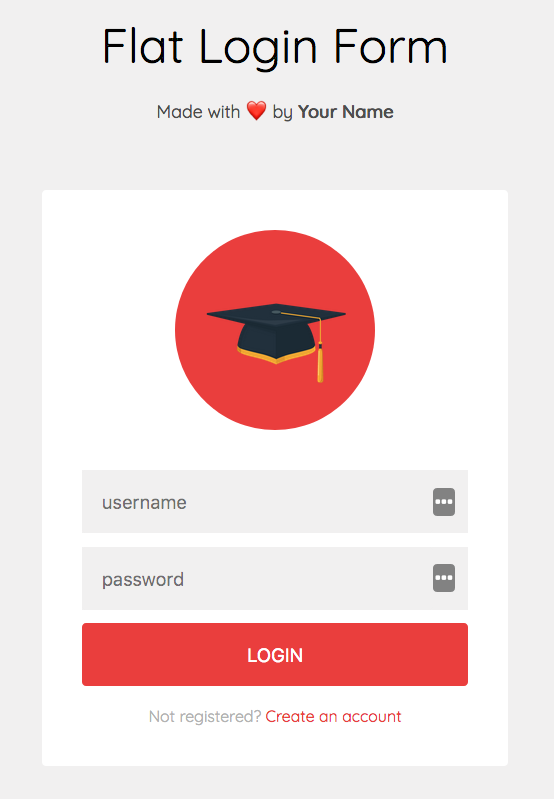

# Flat Login Form

Simple flat login form made in vanilla HTML &amp; CSS.

---

## Setup

1. Clone or download repository.

2. Open `index.html` file using local or file server.

---

### Use case

- Using plain vanilla HTML & CSS
- Positioning elements with a help of **Flexbox**
- Including **FontAwesome 4.7.** icon library

---

*Made for students of UJEP (Univerzita Jana Evangelisty Purkyně) in Ústí nad Labem who are specializing in IT department.*
